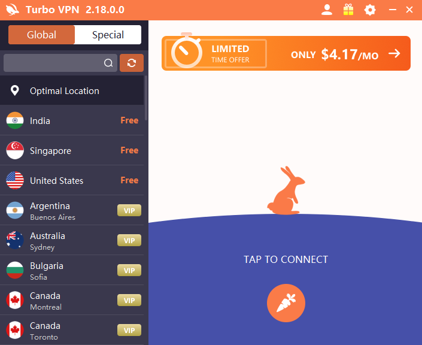
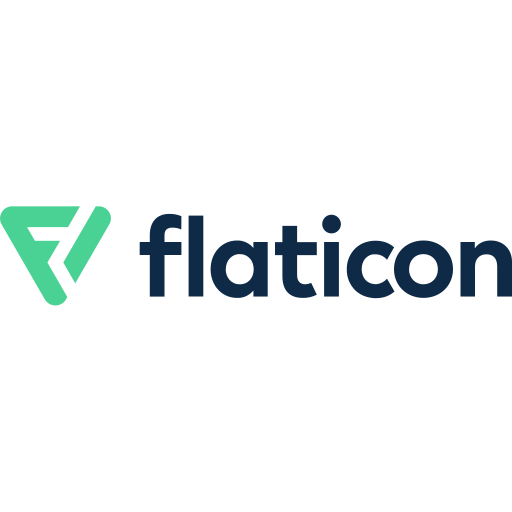

# Turbo VPN Ui with PySide6 and QtDesigner.


## Table of Contents

- [About](#about)
- [Getting Started](#getting_started)
- [Usage](#usage)

## About <a name = "about"></a>

- This is a fun project which proves capabilities of **Python** and **PySide6 | PyQt6** on user interface developement.

**Disclaimer**
> This project does not try to copy or imitate original referenced software
> It's only for education purpose. 

## Getting Started <a name = "getting_started"></a>

These instructions will get you a copy of the project up and running on your local machine for development and testing purposes.
This project took alot of time to complete and documentation is not included.

### Prerequisites
* This project was created on windows thus only tested on a single platform. It should also run on other platforms as Qt and Python runs everywhere.


### Installing

```
pip install pyside6
```
or
```
pip install pyqt6
```

clone repository.
```
git clone https://github.com/tjpin/Turbo-vpn-ui-design.git
```

```
cd turbo\ vpn/
```

run
```
python main.py
```

#### Quick Links and Icons sources.
<p align="left">
  <a href='https://www.patreon.com/chairmanstudios' target="_blank"></a>
</p>
<p align="left">
  <a href='https://www.youtube.com/channel/UCQdH3uO0rIg5ctg8PFb27Pg' target="_blank"></a>
</p>
<p align="left">
  <a href='https://icons8.com/app/' target="_blank"></a>
</p>
<p align="left">
  <a href='https://www.flaticon.com/search' target="_blank"></a>
</p>


